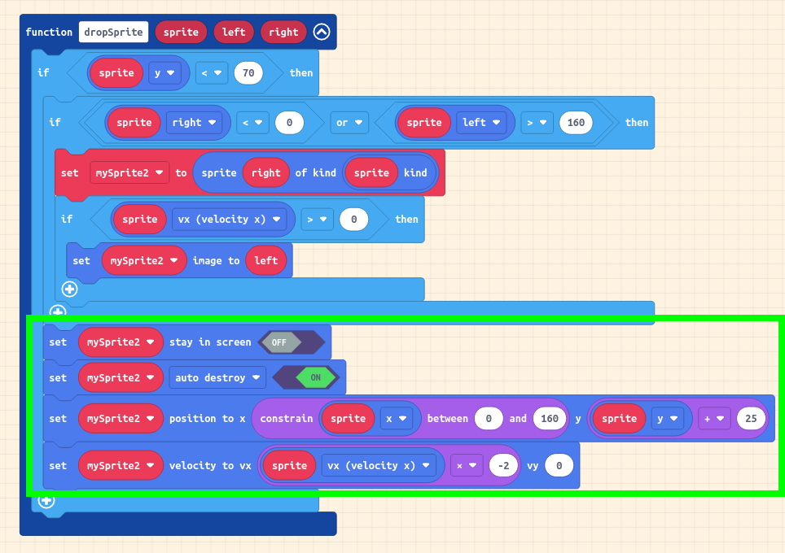
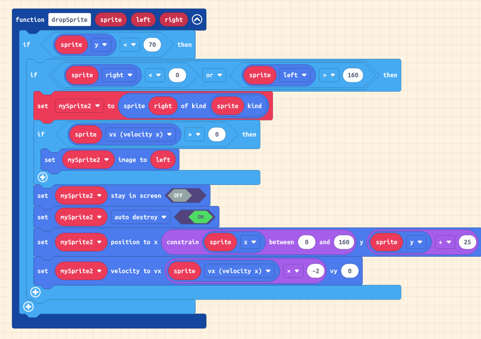

# Errata for Invasion of the Alien Ducks

Step 6 - Creating a function to descend sprites.

After completing step 6, shooting a Duck or Apple that is on the top row will
result in the "Program Error: sim error: failed to cast on null" being reported. The cause is due to the placement of the final 4 blocks in the outer if block highlighted in the below screen shot.

The blocks need moving into the inner if block as shown in this screen shot.

