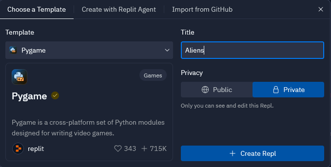

# Aliens

These instructions will take you through the steps of creating a game that uses the
1979 game [Galaxian](https://en.wikipedia.org/wiki/Galaxian) and the
1981 game [Galaga](https://en.wikipedia.org/wiki/Galaga) as its inspiration.

TODO: Game summary

## Step 0: Create the project in Replit

Navigate to [replit](https://replit.com/) and login.

Create a new project using the Pygame template and give it the title "Aliens" as
illustrated by the screenshot below.



In the `main.py` file, replace the code provided with the code below and run the program
to make sure it can download the packages and runs. You should be presented with a black screen
with a red zero for the score at the top of the screen.

```python
import time
import pgzrun
import types

WIDTH = 640
HEIGHT = 700

score = 0
lives = 3
paused = False

def draw():
    screen.clear()
    screen.draw.text(f"{score}", (WIDTH / 2, 15), color="red", fontsize=24)
    
pgzrun.go()
```
