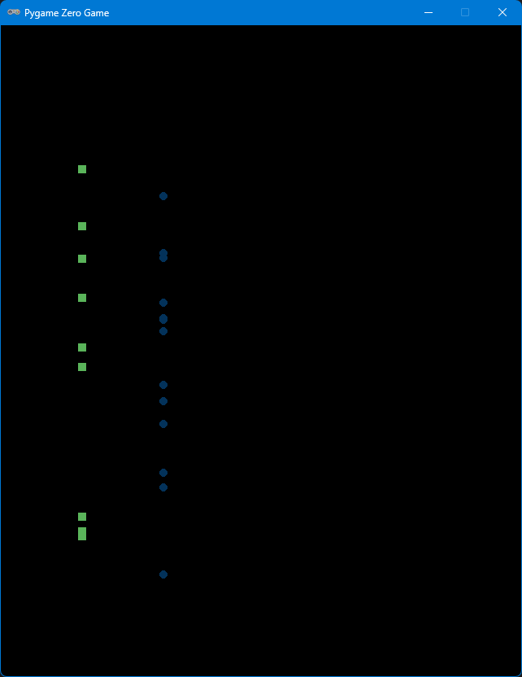
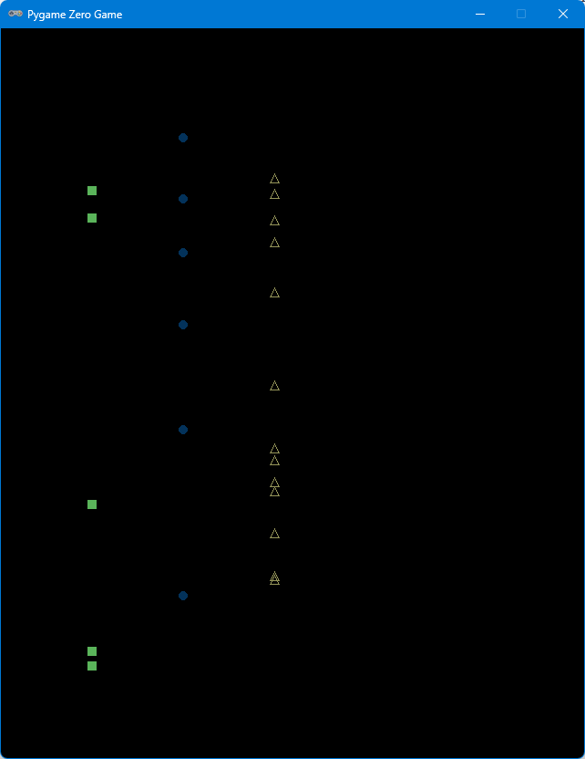

# Classes and inheritance

This short sub-section introduces the Python concepts of classes and inheritance. Once you
have completed this sub-section, you can read more about classes and inheritance from the
following online materials:

* [Python Classes reference](https://www.w3schools.com/python/python_classes.asp)
* [Python Inheritance reference](https://www.w3schools.com/python/python_inheritance.asp)
* [Python Classes tutorial](https://docs.python.org/3/tutorial/classes.html)

## Common behaviour

In [Smash](./smash.md), eight classes were created to represent the different game objects:

* `Paddle`
* `Ball`
* `Block`
* `ParticleScore`
* `ParticleExplosion`
* `BonusLives`
* `BonusPaddle`
* `BonusSpeed`

When writing the code for those classes, did you notice how similar the classes were?

The following properties and methods are present in many of the classes:

* `draw()`
* `update()`
* `bounding_box`
* `position`
* `alive`
  
This is because each of the classes represent game objects and the game itself
expects each game object to have certain behaviour, such as being able to `draw()`
itself. In [Smash](./smash.md), we implemented the expected behaviour in each of
the classes separately. Wouldn't it be great if there was a handy way to share
that functionality so we only needed to implement it once? There is: inheritance.
But before we get to that, we are going to start with a simple demonstration program
that has objects from 2 types of class.

## Demonstration program

Copy the following code into a PyGame Zero project in Replit which will randomly
place `Square`s or `Circle`s at the top of the screen allowing them to fall down
to the bottom for some seconds.

```python
from random import randint

from pgzero.rect import Rect
from pgzero.screen import Screen

WIDTH = 640
HEIGHT = 800
GRAVITY = 120

screen: Screen

game_objects = []


def draw():
    screen.fill((0, 0, 0))

    for game_object in game_objects:
        game_object.draw(screen.draw)


def update(dt):
    global game_objects

    choice = randint(1, 30)
    if choice == 1:
        box = Square(100, 100, 10)
        game_objects.append(box)
    elif choice == 2:
        circle = Circle(200, 100, 5)
        game_objects.append(circle)

    for game_object in game_objects:
        game_object.update(dt)

    game_objects = [game_object for game_object in game_objects if game_object.alive]


class Square:
    def __init__(self, x, y, width):
        self.x = x
        self.y = y
        self.lifetime = 5
        self.colour = (90, 180, 90)
        self.width = width

    @property
    def alive(self):
        return self.lifetime > 0

    def update(self, dt):
        self.lifetime -= dt
        self.y += GRAVITY * dt

    def draw(self, draw):
        half_width = self.width / 2
        rect = Rect(self.x - half_width, self.y - half_width, self.width, self.width)
        draw.filled_rect(rect, self.colour)


class Circle:
    def __init__(self, x, y, radius):
        self.x = x
        self.y = y
        self.lifetime = 5
        self.colour = (3, 50, 90)
        self.radius = radius

    @property
    def alive(self):
        return self.lifetime > 0

    def update(self, dt):
        self.lifetime -= dt
        self.y += GRAVITY * dt

    def draw(self, draw):
        draw.filled_circle((self.x, self.y), self.radius, self.colour)

import pgzrun
pgzrun.go()
```

When you run the code, you will be rewarded with two streams of shapes falling down the
screen as in the image below. Notice how the code for the `Square` and `Circle` is almost
exactly the same, with differences in only the `__init__()` and `draw()` methods. What if
we also want to add in triangles and rectangles to our demo? Would we really need to
duplicate all that code another two times?



### A common ancestor

From the previous code, lets make a new class called `Shape` that has all of the code that
is common between `Square` and `Circle`. It will look like the code below. Note that there
is no `update()` method and the `__init__()` method only sets `x`, `y` and `lifetime`:

```python
class Shape:
    def __init__(self, x, y):
        self.x = x
        self.y = y
        self.lifetime = 5

    @property
    def alive(self):
        return self.lifetime > 0

    def update(self, dt):
        self.lifetime -= dt
        self.y += GRAVITY * dt
```

We can now adapt our original classes to `inherit` the functionality of `Shape`. This is done
by copying in the code for the `Shape` class **before** the `Square` and `Circle` shapes, then changing the `class Square:` to `class Square(Shape):` as shown below:

```python
class Square(Shape):
    def __init__(self, x, y, width):
        self.x = x
        self.y = y
        self.lifetime = 5
        self.colour = (90, 180, 90)
        self.width = width

    @property
    def alive(self):
        return self.lifetime > 0

    def update(self, dt):
        self.lifetime -= dt
        self.y += GRAVITY * dt

    def draw(self, draw):
        half_width = self.width / 2
        rect = Rect(self.x - half_width, self.y - half_width, self.width, self.width)
        draw.filled_rect(rect, self.colour)
```

Do the same for the `Circle` class and run your program to make sure it works. If you get stuck,
the full code up to this point is [here](../../img/python/pygame/smash/classes_2.py).

### Using the common ancestor

Both `Square` and `Circle` descend from `Shape` but still contain the duplicated code. The
code that in the `Shape` class can be removed from  `Square` and `Circle`. The duplicated
code that can be removed is the `alive` property, the `update` method and the `x`, `y` and
`lifetime` variables in the `__init__()` method. The modified `Square` class is shown below:

```python
class Square(Shape):
    def __init__(self, x, y, width):
        self.colour = (90, 180, 90)
        self.width = width

    def draw(self, draw):
        half_width = self.width / 2
        rect = Rect(self.x - half_width, self.y - half_width, self.width, self.width)
        draw.filled_rect(rect, self.colour)
```

Do the same for the `Circle` class. If you get stuck, the full code up to this point is
[here](../../img/python/pygame/smash/classes_3.py).

Run your program now. What happens? Do you get a scary looking error that ends with
`AttributeError: 'Square' object has no attribute 'lifetime'`?

### Calling the parent

The error message that you saw in the previous step provides a hint as to what has gone
wrong: the `lifetime` variable does not exist in your class. So why is this? Your `Square`
and `Circle` classes inherit from the `Shape` class. The `x`, `y` and `lifetime` variables
are added to your classes in `__init__()` method of the `Shape` class. However, because
your classes provide `__init__()` methods of their own, the `Shape` `__init__()` method
is not used. This is called *overriding* and you can read more about it in the links provided
at the top of the page.

So what do we do about it in our code? We call the `__init__()` method of the `Shape` class
from our own classes. This is done by adding `super().__init__(x, y)` to the start of the
`__init__()` method of the `Square` and `Circle` classes. This is shown below for the
`Square` class.

```python
    def __init__(self, x, y, width):
        super().__init__(x, y)
        self.colour = (90, 180, 90)
        self.width = width
```

Make the same change for the `Circle` class. If you get stuck, the full code up to this point
is [here](../../img/python/pygame/smash/classes_4.py).

### Adding a Triangle

Now we are going to extend our code to draw triangles too. Our triangle will have three
points, each defined by a single `size` parameter:

 1. 1 north of `(x, y)`.
 2. 1 south east of  `(x, y)`.
 3. 1 south west of  `(x, y)`.

Because we can make another subclass of `Shape`, we can follow the same pattern as the
`Square` and `Circle` classes. Add the following code immediately below the `Square` and
`Circle` classes:

```Python
class Triangle(Shape):
    def __init__(self, x, y, size):
        super().__init__(x, y)
        self.colour = (150, 150, 90)
        self.size = size

    def draw(self, draw):
        top = (self.x, self.y - self.size)
        east = (self.x - self.size, self.y + self.size)
        west = (self.x + self.size, self.y + self.size)
        draw.line(top, east, self.colour)
        draw.line(top, west, self.colour)
        draw.line(east, west, self.colour)
```

If you run your game, no `Triangle` shapes will be displayed. This is because we have not
yet created any to display. The `update()` function is where we create these shapes. Add
the following code to the `update ()` function after the code that creates the `Circle`
shapes. Run your program, it should look similar to the screen shot below. If you have any
difficulty, the full code can be found [here](../../img/python/pygame/smash/classes_5.py).

```python
    elif choice == 3:
        triangle = Triangle(300, 100, 5)
        game_objects.append(triangle)
```



### Experiment

Now try adding a Rectangle shape to your demonstration?

What other shapes can you think of adding?
