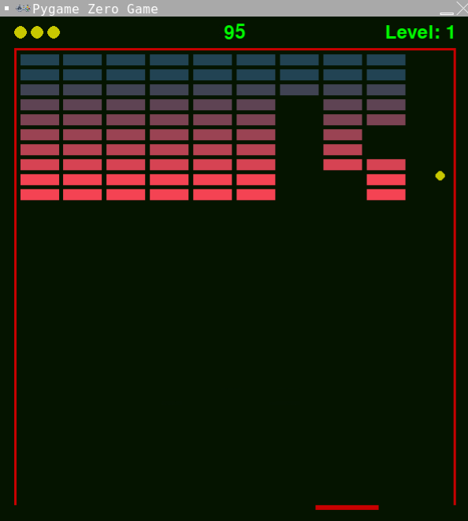

# Smash

These instructions will take you through the steps of creating a game that uses the
1976 game [Breakout](https://en.wikipedia.org/wiki/Breakout_(video_game)) as its inspiration.

You will control a paddle along the bottom of the screen to bounce balls at the grid
of blocks across the top of the screen. Each time you clear all of the blocks, you
will be given another life and advance a level to do it all again.

The ball passes through some blocks and bounces on others. When destroyed, Some blocks
drop a bonus that will be either more lives, a bigger paddle or slow the ball down.

How many levels can you complete?


## Learning points

These instructions will take you through the process of creating a game which does not
use Actors for sprites. Instead, the game is implemented using drawing primitives such
as rectangles, circles and individual pixels. Python Classes are used to implement the
game objects with these primitives, showing the flexibility that is on offer.

These instructions are suitable for you if you are comfortable with basic Python coding.

## Step 0: Create the project in Replit

Navigate to [replit](https://replit.com/) and login.

Create a new project using the Pygame template and give it the title "Smash" as
illustrated by the screenshot below.


In the `main.py` file, replace the code provided with the code below and run the program
to make sure it can download the packages and runs. You should be presented with a greenish
black screen. You can change the colour of the background by modifying the value of the
`BACKGROUND_COLOUR` variable. Colours are specified with 3 values that represent the red,
green and blue components of the colour. Each component value can be between 0 and 255.

The screen area of the game can be adjusted by changing the values of the `WIDTH` and
`HEIGHT` variables. After clearing the screen, the `draw()` function loops over the list
`draw_funcs`. In later steps we will be adding functions to this list to draw the elements
on the screen. The advantage of this technique is that the `draw()` function will not need
to modified in those later steps. We do a similar technique for the `update()` function.

Experiment to find the colours and screen size that you like the most.

```python
import os
import random
from copy import copy
from random import randint

import pgzrun
from pgzero.clock import Clock
from pgzero.keyboard import Keyboard
from pgzero.rect import Rect
from pgzero.screen import Screen

WIDTH = 600
HEIGHT = 640

screen: Screen
keyboard: Keyboard
clock: Clock

BACKGROUND_COLOUR = (5, 20, 0)

draw_funcs = []

def draw():
    screen.fill(BACKGROUND_COLOUR)
    for draw_func in draw_funcs:
        draw_func(screen.draw)

update_funcs = []

def update(dt):
    for update_func in update_funcs:
        update_func(dt)

pgzrun.go()
```

## Step 1: Setup score, level, border and lives

The completed code for this step is available [here](../../img/python/pygame/smash/main_step_1.py).

Now we are going to draw the score, level, border and lives on the screen. We
will create functions to draw each of the separate elements. Each section of
code can be added and tested individually. Place the following code before the
call to `pgzrun.go()`. Run your game after you have added each section and you
should see each section as it gets added.

### Add the score

```python
HEADER_HEIGHT = 40
FOOTER_HEIGHT = 20
MARGIN_WIDTH = 20

SCORE_COLOUR = (0, 255, 0)

score = 0

def draw_score(draw):
    draw.text(f"{score}",
              center=(WIDTH / 2, HEADER_HEIGHT / 2),
              color=SCORE_COLOUR,
              fontsize=36)

draw_funcs.append(draw_score)
```

### Add the level

```python
LEVEL_COLOUR = (0, 255, 0)

level = 1

def draw_level(draw):
    draw.text(f"Level: {level}",
              right=(WIDTH - MARGIN_WIDTH),
              centery=HEADER_HEIGHT / 2,
              color=LEVEL_COLOUR,
              fontsize=36)

draw_funcs.append(draw_level)
```

### Add the border

```python
BORDER_COLOUR = (200, 0, 0)
BORDER_WIDTH = 3

def draw_border(draw):
    left = MARGIN_WIDTH
    top = HEADER_HEIGHT
    width = WIDTH - (2 * MARGIN_WIDTH)
    height = HEIGHT - HEADER_HEIGHT - FOOTER_HEIGHT
    draw.filled_rect(Rect(left, top, width, height), BORDER_COLOUR)

    left += BORDER_WIDTH
    top += BORDER_WIDTH
    width -= (2 * BORDER_WIDTH)
    draw.filled_rect(Rect(left, top, width, height), BACKGROUND_COLOUR)

draw_funcs.append(draw_border)
```

### Add the lives

```python
LIVES_COLOUR = (200, 200, 0)
LIVES_RADIUS = 8
LIVES_SPACING = 5

STARTING_LIVES = 3

lives = STARTING_LIVES

def draw_lives(draw):
    for i in range(lives):
        x = MARGIN_WIDTH + LIVES_RADIUS + (i * (
            (2 * LIVES_RADIUS) + LIVES_SPACING))
        y = HEADER_HEIGHT / 2
        draw.filled_circle((x, y), LIVES_RADIUS, LIVES_COLOUR)

draw_funcs.append(draw_lives)
```

Run your game and make sure it works; it should look like the screen shot below.


### Experiment: Changing the look of the game

The *look* of the game is controlled by the 10 variables that are in UPPERCASE at
the start of the code you have just added. The names of the variables should be
reasonably self explanatory. Experiment with different values for some of the
variables and see how it changes the screen. Inspect the code to work out how
the code achieves the effects.

Some good values to experiment with:

* `HEADER_HEIGHT`: 20, 40, 100, 200
* `FOOTER_HEIGHT`: 10, 20, 40, 100
* `MARGIN_WIDTH`: 10, 20, 40, 100
* `BORDER_WIDTH`: 1, 3, 6, 20, 40
* `LIVES_RADIUS`: 1, 3, 8, 12, 20, 50
* `LIVES_SPACING`: -3, 0, 5, 10, 20

Experiment with changing the colours to find some you like. As with the background, colours
are specified with 3 values that represent the red, green and blue components of the colour.
Each component value can be between 0 and 255.

## Step 2: Paddle and movement

The completed code for this step is available [here](../../img/python/pygame/smash/main_step_2.py).

In this step, the paddle which can be moved across the bottom of the screen using the
left and right arrow keys will be added. A *Class* called `Paddle` will be created to
control how the paddle is draw and controlled. The following *methods* of the `Paddle`
*Class* are worthy of a little more explanation.

* `bounding_box()` - This returns a `Rect` instance that represents the space occupied by the
  paddle. This is used later for collision detection.
* `draw()` - This *draws* the paddle on the supplied `SurfacePainter` object.
* `update()` - This is called to update the position of the paddle. As well as moving the
  paddle in response to keypresses, it keeps the paddle in bounds.

Place the following code before the call to `pgzrun.go()`.

```python
PADDLE_COLOUR = (200, 0, 0)
PADDLE_WIDTH = 80
PADDLE_HEIGHT = 6
PADDLE_SPEED = 400

class Paddle:
    def __init__(self, pos):
        self.position = pos
        self.width = PADDLE_WIDTH
        self.height = PADDLE_HEIGHT
        self.colour = PADDLE_COLOUR

        # This is the speed the paddle can go left and right in pixels per second
        self.vx = PADDLE_SPEED

        # These are the bounds that the paddles box must stay within
        self.min_x = MARGIN_WIDTH + (PADDLE_WIDTH / 2)
        self.max_x = WIDTH - MARGIN_WIDTH - (PADDLE_WIDTH / 2)

    @property
    def bounding_box(self):
        half_width = int(self.width / 2)
        return Rect((self.x - half_width, self.y), (self.width, self.height))

    @property
    def position(self):
        return self.x, self.y

    @position.setter
    def position(self, pos):
        self.x = pos[0]
        self.y = pos[1]

    def draw(self, draw):
        draw.filled_rect(self.bounding_box, self.colour)

    def update(self, dt):
        if keyboard.left:
            self.x -= self.vx * dt
        if keyboard.right:
            self.x += self.vx * dt

        # Now keep it in bounds
        if self.x < self.min_x:
            self.x = self.min_x
        elif self.x > self.max_x:
            self.x = self.max_x


paddle = Paddle((WIDTH / 2, HEIGHT - FOOTER_HEIGHT))
```

If you run your game now, the paddle will not be displayed and will not respond to
keypresses. This is because the paddle has not yet been hooked into the main game
loops to call the paddles `update()` and `draw()` *methods*. Add the following
`update()` function.

```python
draw_funcs.append(paddle.draw)
update_funcs.append(paddle.update)
```

Run your game and make sure it works; it should look like the screen shot below. Pressing the
left and right keys will move the paddle left and right.


### Experiment: Changing the look and speed of the paddle

Just as the earlier sections allow the look and feel of the game to be changed by modifying
values of the UPPERCASE variables, the paddle can be changed too. Experiment with different
values for the following variables:

* `PADDLE_COLOUR`: This will be a (red, green, blue) triplet.
* `PADDLE_WIDTH`: 10, 20, 40, 80, 160, 500
* `PADDLE_HEIGHT`: 1, 3, 6, 10, 20, 50
* `PADDLE_SPEED`: 0, 100, 200, 400, 1000

## Step 3: Adding the ball

The completed code for this step is available [here](../../img/python/pygame/smash/main_step_3.py).

In this step, the ball will be added. Once served, the ball will move itself as well as keep
itself within the screen bounds. A *Class* called `Ball` will be created to control how the
ball behaves. Just like the `Paddle` *Class*, `Ball` will have `bounding_box()`, `draw()` and
`update()` *methods*. `Ball` also has *methods* to detect for collisions with itself and for
bouncing.

Place the following code before the call to `pgzrun.go()`.

```python
BALL_RADIUS = 6
BALL_COLOUR = (200, 200, 0)
BALL_SPEED_Y = 500
BALL_SPIN_X_MIN = 100
BALL_SPIN_X_MAX = 200

class Ball:

    def __init__(self, pos):
        self.position = pos
        self.vx = 0
        self.vy = 0
        self.radius = BALL_RADIUS
        self.colour = BALL_COLOUR
        self.min_x = MARGIN_WIDTH + BORDER_WIDTH + BALL_RADIUS
        self.max_x = WIDTH - MARGIN_WIDTH - BORDER_WIDTH - BALL_RADIUS
        self.min_y = HEADER_HEIGHT + BORDER_WIDTH + BALL_RADIUS
        self.max_y = HEIGHT

    @property
    def bounding_box(self):
        # Returns the bounding box of the ball
        x = self.x - self.radius
        y = self.y - self.radius
        width = 2 * self.radius
        height = 2 * self.radius
        return Rect(x, y, width, height)

    @property
    def position(self):
        return self.x, self.y

    @position.setter
    def position(self, pos):
        self.x = pos[0]
        self.y = pos[1]

    def draw(self, draw):
        draw.filled_circle(self.position, self.radius, self.colour)

    def update(self, dt):
        # Move the ball and keep it in bounds.
        self.x += (self.vx * dt)
        self.y += (self.vy * dt)

        if self.x < self.min_x:
            self.x = self.min_x
            self.vx *= -1
        elif self.x > self.max_x:
            self.x = self.max_x
            self.vx *= -1

        if self.y < self.min_y:
            self.y = self.min_y
            self.vy *= -1
        elif self.y > self.max_y:
            self.y = self.max_y
            self.vy *= -1

    def stop(self):
        self.vx = 0
        self.vy = 0

    def serve(self):
        self.hit(-BALL_SPEED_Y)

    def bounce(self):
        self.hit(self.vy * -1)

    def hit(self, vertical_speed):
        self.vy = vertical_speed
        spin = random.randint(BALL_SPIN_X_MIN, BALL_SPIN_X_MAX)
        if keyboard.left:
            self.vx -= spin
        else:
            self.vx += spin

    def collide(self, rect) -> bool:
        return self.bounding_box.colliderect(rect)


ball = Ball(paddle.position)

draw_funcs.append(ball.draw)
update_funcs.append(ball.update)
```

Run your game and make sure it works; it should look like the screen shot below.

Does the ball move when you move the paddle? Why do you think this might be?


### Experiment: Changing the look and speed of the ball

Just as the earlier sections allow the look and feel of the game to be changed by
modifying values of the UPPERCASE variables, the ball can be changed too. Experiment
with different values for the following variables:

* `BALL_RADIUS`: 1, 3, 6, 10, 20, 50
* `BALL_COLOUR`: This will be a (red, green, blue) triplet.

## Step 4: Serving the ball

The completed code for this step is available [here](../../img/python/pygame/smash/main_step_4.py).

In this step, we will add the code to serve the ball. This will also include the code
which keeps the ball with the paddle before serving.

Place the following code before the call to `pgzrun.go()`.

```python
playing = False
serving = True
game_over = False

def start_game(dt):
    global score, level, lives, playing, serving, game_over

    if not playing and keyboard.space:
        score = 0
        level = 1
        lives = STARTING_LIVES
        playing = True
        serving = True
        game_over = False
        setup_blocks()


def serve_ball(dt):
    global serving, ball

    if serving:
        # If we are serving, keep the ball with the paddle.
        ball.position = paddle.position

        # If space is pressed, serve the ball
        if keyboard.space:
            serving = False
            ball.serve()

update_funcs.append(start_game)
update_funcs.append(serve_ball)
```

Run your game and move the paddle. The ball should move with it. The final step is
to add the serving `draw()` code as follows.

```python
def draw_serving(draw):
    if serving:
        draw.text(f"Level {level}",
                  center=(WIDTH / 2, HEIGHT / 2),
                  color=SCORE_COLOUR,
                  fontsize=72)
        draw.text("Press space to serve",
                  center=(WIDTH / 2, HEIGHT * 3 / 4),
                  color=SCORE_COLOUR,
                  fontsize=36)

draw_funcs.append(draw_serving)
```

Run your game and make sure it works; it should look like the screen shot below.

Does the ball stay with the paddle when you move it left and right?

What happens when you press space to serve the ball?

You will get an error that starts: `Traceback (most recent call last):`

And finishes: `NameError: name 'setup_blocks' is not defined`

This is because there are currently no blocks setup in the game. This is what we
will do in the next step.


### Experiment: Changing the look of the level and serving text

The `draw()` function is where the text is drawn on the screen. The text is drawn in
the same colour as the score. Experiment with changing the colour and size of the two
pieces of text to find something you like.

You can also experiment with changing the position of the text.

## Step 5: Adding blocks

The completed code for this step is available [here](../../img/python/pygame/smash/main_step_5.py).

In this step we will place the blocks on the screen. As we have done with both the paddle and ball
we will create a new *Class* called 'Block' to represent an individual block. With the `Paddle` and
`Ball` classes, there was only ever a single instance of each in the game. With `Block` it will be
different as there will be many instances of block. The `Block` class is a small simple class that
just displays itself in a static position. One unique property of a block is that it has a one in
five change chance of the `Bounce()` function returning true. We will make use of this in a later
step.

Place the following code before the call to `pgzrun.go()`.

```Python
class Block:

    def __init__(self, rect, colour, value):
        self.rect = rect
        self.colour = colour
        self.value = value

    @property
    def bounding_box(self):
        return self.rect

    @property
    def bounce(self):
        return randint(0, 4) == 0

    def draw(self, draw):
        draw.filled_rect(self.bounding_box, self.colour)
```

Because we will always create the blocks in the same positions, we can calculate
those positions once at the start of the game and then reuse them. These positions
will be stored in the list variable `block_rects` and calculated in the function
`setup_block_rects()`. The blocks themselves will be stored in a list variable
called `blocks` and those blocks will be created in the function `setup_blocks()`
which will use the values we calculated in `block_rects`.

Place the following code before the call to `pgzrun.go()`.

```python
BLOCK_GAP = 5
BLOCK_COLUMNS = 10
BLOCK_HEIGHT = 14
BLOCK_COLOURS = [
    (34, 67, 83),
    (34, 67, 83),
    (64, 67, 83),
    (94, 67, 83),
    (124, 67, 83),
    (154, 67, 83),
    (184, 67, 83),
    (214, 67, 83),
    (244, 67, 83),
    (244, 67, 83),
]
BLOCK_AREA_WIDTH = WIDTH - (2 * MARGIN_WIDTH) - (2 * BORDER_WIDTH) - BLOCK_GAP
BLOCK_AREA_LEFT = MARGIN_WIDTH + BORDER_WIDTH + BLOCK_GAP
BLOCK_AREA_TOP = HEADER_HEIGHT + BORDER_WIDTH + BLOCK_GAP
BLOCK_AND_GAP_WIDTH = BLOCK_AREA_WIDTH / BLOCK_COLUMNS
BLOCK_WIDTH = BLOCK_AND_GAP_WIDTH - BLOCK_GAP
BLOCK_AND_GAP_HEIGHT = BLOCK_HEIGHT + BLOCK_GAP

block_rects = []

def setup_block_rects():
    global block_rects

    for x in range(BLOCK_COLUMNS):
        block_rects.append([])
        for y in range(len(BLOCK_COLOURS)):
            left = BLOCK_AREA_LEFT + (BLOCK_AND_GAP_WIDTH * x)
            top = BLOCK_AREA_TOP + (BLOCK_AND_GAP_HEIGHT * y)
            rect = Rect(left, top, BLOCK_WIDTH, BLOCK_HEIGHT)
            block_rects[x].append(rect)

blocks = []

def setup_blocks():
    global blocks
    blocks = []

    for x in range(len(block_rects)):
        for y in range(len(block_rects[x])):
            rect = block_rects[x][y]
            colour = BLOCK_COLOURS[y]
            blocks.append(Block(rect, colour, 10 - y))

setup_block_rects()
setup_blocks()

def draw_blocks(draw):
    for block in blocks:
        block.draw(draw)

draw_funcs.append(draw_blocks)
```

Run your game and make sure it works; it should look like the screen shot below.

Serve the ball, what happens when the ball hits a block? Why do you think this might be?

What happens if the ball misses the paddle? Why do you think that might be?


### Experiment: Changing the number and look of the blocks

Just as the earlier sections allow the look and feel of the game to be changed by
modifying values of the UPPERCASE variables, the number and size of the blocks can
be changed too. Experiment with different values for the following variables:

* `BLOCK_GAP`: 0, 1, 3, 5, 10, 20
* `BLOCK_COLUMNS`: 1, 2, 4, 10, 20, 100
* `BLOCK_HEIGHT`: 1, 2, 5, 10, 14, 30
* `BLOCK_COLOURS`: : This are all (red, green, blue) triplets.

Also, now the ball moves, experiment with changing the following variables:

* `BALL_SPEED_Y`: 100, 300, 1000, 3000
* `BALL_SPIN_X_MIN`: 0, 50, 100, 200
* `BALL_SPIN_X_MAX`: 100, 200, 500, 1000

## Step 6: Destroying the blocks

The completed code for this step is available [here](../../img/python/pygame/smash/main_step_6.py).

In this step, we will get the ball to destroy the blocks. We will write a new function
called `check_for_collisions()` that will do the checking for us as well as updating
the players score. Inside this new function a list called `blocks_to_destroy` is created.
That list is created using a very powerful Python technique called a [list comprehension](https://docs.python.org/2/tutorial/datastructures.html#list-comprehensions). Python list comprehensions
are efficient ways to create new lists. The list comprehension in `check_for_collisions()`
creates a new list containing the blocks whose `bounding_box` collides with the balls
`bounding_box`.

To add a little twist to the game, we don't want the ball to just fly through all of the
blocks some blocks until it hits the back wall. We therefore bounce the ball if the
block indicates it should bounce.

Place the following code before the call to `pgzrun.go()`.

```python
def check_for_collisions(dt):
    global score, blocks

    if ball.vy > 0 and ball.collide(paddle.bounding_box):
        ball.bounce()

    blocks_to_destroy = [block for block in blocks if ball.collide(block.bounding_box)]
    if blocks_to_destroy:
        for block in blocks_to_destroy:
            score += block.value
            blocks.remove(block)
            if block.bounce:
                ball.bounce()

update_funcs.append(check_for_collisions)
```

Run your game and make sure it works; it should look like the screen shot below.



## Step 7: Dropping the ball

The completed code for this step is available [here](../../img/python/pygame/smash/main_step_7.py).

In the previous step, the ball happily bounces around the screen for ever. The behaviour
we want is for the ball the bounce along the bottom only if it makes contact with the
paddle. If the ball does not make contact with the paddle, it should be considered *dropped*
and the player loses a life.

Place the following code before the call to `pgzrun.go()`.

```python
def check_for_dropping_the_ball(dt):
    global lives, playing, serving, game_over

    if ball.y > (paddle.y + paddle.height + ball.radius):
        ball.stop()
        serving = True
        lives -= 1
        if lives <= 0:
            game_over = True
            playing = False

update_funcs.append(check_for_dropping_the_ball)
```

Run your game and make sure it works; it should look like the screen shot below.

What happens when you lose all of your lives?

To make it easier to clear the blocks, change the number of columns to 2 and
comment out some of the colours in the `BLOCK_COLOURS` variable. What happens
when you clear all of the blocks? Why do you think that is?


## Step 8: Levels and lives

The completed code for this step is available [here](../../img/python/pygame/smash/main_step_8.py).

In this step, we will be checking for when the player has cleared all of the blocks
and so a new level needs to be started. We will award the player an extra life for
each level they clear. We will also add in a "GAME OVER" message.

Place the following new function before the call to `pgzrun.go()`.

```python
def check_for_new_level(dt):
    global level, lives, playing, serving, blocks

    if playing and len(blocks) == 0:
        level += 1
        lives += 1
        serving = True
        setup_blocks()

update_funcs.append(check_for_new_level)
```

Finally, add the code to draw the "GAME OVER" text.

```python
def draw_game_over(draw):
    if game_over:
        draw.text("GAME OVER",
                  center=(WIDTH / 2, HEIGHT * 5 / 8),
                  color=SCORE_COLOUR,
                  fontsize=72)

draw_funcs.append(draw_game_over)
```

Run your game and make sure it works; it should look like the screen shot below.


### Experiment: Changing the look and position of the GAME OVER text

Experiment with the position, colour and size of the GAME OVER text to find
something you like the look of.

## Step 9: Add particle effects

The completed code for this step is available [here](../../img/python/pygame/smash/main_step_9.py).

In this step, we will be adding some particle effects when the blocks gets destroyed. Each particle
effect will only last for a few seconds and is designed to add visual interest to the game. all the
particle effects will have gravity applied to them which will make them tend towards the bottom of
the screen over time. Two particle effects will be added:

* `ParticleScore`: This will be a single particle containing the score value of the block destroyed.
  It will slowly fall towards the ground.
* `ParticleExplosion`:  This will generate a preset number of dots in the colour of the block that
  are spread in random directions from the centre of the block before slowly falling towards the ground.

As well as the usual `update()` and `draw()` methods, all particle effects need an `alive` property
which will return `True` is the particle effect is still running or `False` is the particle effect
has completed. This property will be used by the game engine to remove completed particle effects.

### Score particle effect

The first particle effect we will add is `ParticleScore`. We will also add the `GRAVITY` and
`particles` variables. The `GRAVITY` variable represent the gravity which applies to the particles
(in pixels per second). The `particles` list variable holds all particles effects currently
operating. The `ParticleScore` *Class* will draw just a single number. The direction that the
effect will *take* is chosen randomly (from a defined range) when an instance of `ParticleScore`
if created.

Place the following code before the call to `pgzrun.go()`.

```python
GRAVITY = 60

particles = []

PARTICLE_SCORE_MIN_VX = -60
PARTICLE_SCORE_MAX_VX = 60
PARTICLE_SCORE_MIN_VY = -30
PARTICLE_SCORE_MAX_VY = 60


class ParticleScore:

    def __init__(self, pos, lifetime, value):
        self.position = pos
        self.left = lifetime
        self.value = value
        self.vx = randint(PARTICLE_SCORE_MIN_VX, PARTICLE_SCORE_MAX_VX)
        self.vy = randint(PARTICLE_SCORE_MIN_VY, PARTICLE_SCORE_MAX_VY)

    @property
    def position(self):
        return self.x, self.y

    @position.setter
    def position(self, pos):
        self.x = pos[0]
        self.y = pos[1]

    @property
    def alive(self):
        return self.left > 0

    def draw(self, draw):
        draw.text(f"{self.value}",
                     center=self.position,
                     color=SCORE_COLOUR,
                     fontsize=24)

    def update(self, dt):
        self.left -= dt
        self.vy += (GRAVITY * dt)
        self.x += self.vx * dt
        self.y += self.vy * dt
```

### Explosion partcile effect

The second particle effect that is to be added is `PartcleExplosion`. Whereas `ParticleScore`
displayed a single number, `ParticleExplosion` will display lots of pixels (configured by the
`PARTICLE_EXPLOSION_PARTICLES` variable). `ParticleExplosion` is a little more complicated
than `ParticleScore` due to having multiple pixels; though you have seen all coding techniques
used here in previous steps. Of particular note is the use of a [list comprehension](https://docs.python.org/2/tutorial/datastructures.html#list-comprehensions)
 in the `update()` method.

Place the following code below `ParticleScore`.

```python
PARTICLE_EXPLOSION_MIN_VX = -90
PARTICLE_EXPLOSION_MAX_VX = 90
PARTICLE_EXPLOSION_MIN_VY = -90
PARTICLE_EXPLOSION_MAX_VY = 90
PARTICLE_EXPLOSION_PARTICLES = 30


class ParticleExplosion:

    def __init__(self, pos, lifetime, colour):
        self.left = lifetime
        self.colour = colour
        self.particles = [(pos[0], pos[1],
                           randint(PARTICLE_EXPLOSION_MIN_VX,
                                   PARTICLE_EXPLOSION_MAX_VX),
                           randint(PARTICLE_EXPLOSION_MIN_VY,
                                   PARTICLE_EXPLOSION_MAX_VY))
                          for _ in range(PARTICLE_EXPLOSION_PARTICLES)]

    @property
    def alive(self):
        return self.left > 0

    def draw(self, draw):
        for particle in self.particles:
            draw.filled_circle((particle[0], particle[1]), 1, self.colour)

    def update(self, dt):
        self.left -= dt

        self.particles = [(particle[0] + (particle[2] * dt),
                           particle[1] + (particle[3] * dt), particle[2],
                           particle[3] + (GRAVITY * dt))
                          for particle in self.particles]
```

### Hooking the particle effects in

For the particle effects to be added to the game engine, a small change needs to be made to the
`check_for_collisions()` method to add the effects when a block is destroyed. The two lines of
code that need to be added are given below. The values 2 and 4 represent the lifetime (think
duration) that each partcile effect will last for.

```python
particles.append(ParticleScore(block.rect.center, 2, block.value))
particles.append(ParticleExplosion(block.rect.center, 4, block.colour))
```

Add those two lines of code to the `check_for_collisions()` function. The function
`check_for_collisions()` should now look like this:

```python
def check_for_collisions(dt):
    global score, blocks

    blocks_to_destroy = [
        block for block in blocks if ball.collide(block.bounding_box)
    ]
    if blocks_to_destroy:
        for block in blocks_to_destroy:
            score += block.value
            blocks.remove(block)
            if block.bounce:
                ball.bounce()

            particles.append(ParticleScore(block.rect.center, 2, block.value))
            particles.append(ParticleExplosion(block.rect.center, 4, block.colour))                
```

All that remains now is to update and draw the particles. Place the following code
before the call to `pgzrun.go()`. 

```python
def update_particles(dt):
    global particles
    for particle in particles:
        particle.update(dt)

    particles = [particle for particle in particles if particle.alive]

update_funcs.append(update_particles)

def draw_particles(draw):
    for particle in particles:
        particle.draw(draw)

draw_funcs.append(draw_particles)
```

Run your game and make sure it works; it should look like the screen shot below.


### Experiment: Changing the particles

Experiment with changing the lifetimes of the particles. Unlike previous settings, the
lifetimes are not set through UPPERCASE variables. The lifetimes of the particles are
set in the `check_for_collisions()` function. See if you can find the values. Try values
from 1 through to 10 to see what effect it has.

There are other aspects of the PARTICLES that can be changed by modifying values of
UPPERCASE variables. The `GRAVITY` variable affects both particle effects but the other
variables affect only one of them. Experiment with different values for the following variables:

* `GRAVITY`: 0, 10, 30, 60, 100, 200

* `PARTICLE_SCORE_MIN_VX`: -200, -100, -60, 0, 60
* `PARTICLE_SCORE_MAX_VX`: -30, 0, 30, 60, 100, 200, 1000
* `PARTICLE_SCORE_MIN_VY`: -200, -100, -60, -30, 0, 60
* `PARTICLE_SCORE_MAX_VY`: -30, 0, 30, 60, 100, 200, 1000

* `PARTICLE_EXPLOSION_MIN_VX`: -200, -90, -60, 0, 60
* `PARTICLE_EXPLOSION_MAX_VX`: -30, 0, 30, 60, 90, 200, 1000
* `PARTICLE_EXPLOSION_MIN_VY`: -200, -90, -60, -30, 0, 60
* `PARTICLE_EXPLOSION_MAX_VY`: -30, 0, 30, 60, 90, 200, 1000
* `PARTICLE_EXPLOSION_PARTICLES`: 1, 5, 30, 100, 1000

### Extension: Add your own particle effects

Try adding your own particle effect. Using the `ParticleScore` as your template, design
a particle effect that writes a randomly selected word from a list. The following code
snippet is one way to randomly select a word from a list:

```python
word = random.choice(["boom", "bang", "crash", "wallop"])
```

## Step 10: Dropping bonuses

The completed code for this step is available [here](../../img/python/pygame/smash/main_step_10.py).

In this step, we will be adding bonuses that randomly get dropped when a block is destroyed. The
steps to add bonuses to the game are very similar to those that were used to add particles. The
primary difference between bonuses and particles is the bonuses float to the bottom of the screen
where they can be collected by the paddle. If the bonuses are *dropped* then they are lost. There
particle effects will be added:

* `BonusLives`: If collected, the player will be awarded between 1 and 3 extra lives
* `BonusPaddle`: If collected, the paddle will double in size for a short period.
* `BonusSpeed`: If collected, the vertical speed of the ball will be reduced for a short period.

As well as the usual `update()` and `draw()` methods, all bonuses need an `alive` property
which will return `True` is the bonus has not been caught and is still on the screen or `False`
otherwise. This property will be used by the game engine to remove caught or dropped bonuses.

In addition, each bonus needs a `catch()` method which is called when the paddle makes contact
with the bonus. The `catch()` method allows the bonus to perform the appropriate action such as
give the player more lives, make the paddle bigger or slow the ball down.

### Extra lives bonus

The first bonus effect is `BonusLives`. When created it will randomly choose how many lives to
award the player if caught.

Place the following code before the call to `pgzrun.go()`.

```python
BLACK = (0, 0, 0)
WHITE = (255, 255, 255)

BONUS_WIDTH = 60
BONUS_HEIGHT = 40

bonuses = []


class BonusLives:

    def __init__(self, rect):
        self.rect = copy(rect)
        self.caught = False
        self.lives = randint(1, 3)

    @property
    def bounding_box(self):
        return self.rect

    @property
    def alive(self):
        return not self.caught and self.rect.y < HEIGHT

    def draw(self, draw):
        draw.filled_rect(self.bounding_box, WHITE)
        draw.text(f"lives x{self.lives}",
                  center=self.bounding_box.center,
                  color=BLACK,
                  fontsize=20)

    def update(self, dt):
        self.rect.y += GRAVITY * 4 * dt

    def catch(self):
        global lives
        lives += self.lives
        self.caught = True
```

### Larger paddle bonus

The second bonus effect is `BonusPaddle`. This will make the paddle twice as wide
as usual for a short period of time. The duration the paddle is bigger is randomly
selected between 5 and 10 seconds in the `catch()` method.

Place the following code below `BonusLives`.

```python
def reset_paddle():
    paddle.width = PADDLE_WIDTH


class BonusPaddle:

    def __init__(self, rect):
        self.rect = copy(rect)
        self.caught = False

    @property
    def bounding_box(self):
        return self.rect

    @property
    def alive(self):
        return not self.caught and self.rect.y < HEIGHT

    def draw(self, draw):
        draw.filled_rect(self.bounding_box, WHITE)
        draw.text(f"paddle",
                  center=self.bounding_box.center,
                  color=BLACK,
                  fontsize=20)

    def update(self, dt):
        self.rect.y += GRAVITY * 4 * dt

    def catch(self):
        paddle.width = PADDLE_WIDTH * 2
        clock.schedule_unique(reset_paddle, randint(5, 10))
        self.caught = True
```

### Slower ball bonus

The third bonus effect is `BonusSpeed`. This will make the balls vertical speed slower
for a short period of time. The duration the ball is slowwer is randomly selected between
10 and 20 seconds in the `catch()` method.

Place the following code below `BonusPaddle`.

```python
def reset_ball():
    if ball.vy > 0:
        ball.vy = BALL_SPEED_Y
    else:
        ball.vy = -BALL_SPEED_Y


class BonusSpeed:

    def __init__(self, rect):
        self.rect = copy(rect)
        self.caught = False

    @property
    def bounding_box(self):
        return self.rect

    @property
    def alive(self):
        return not self.caught and self.rect.y < HEIGHT

    def draw(self, draw):
        draw.filled_rect(self.bounding_box, WHITE)
        draw.text(f"speed",
                  center=self.bounding_box.center,
                  color=BLACK,
                  fontsize=20)

    def update(self, dt):
        self.rect.y += GRAVITY * 4 * dt

    def catch(self):
        if ball.vy > 0:
            ball.vy = BALL_SPEED_Y / 4
        else:
            ball.vy = -BALL_SPEED_Y / 4

        clock.schedule_unique(reset_ball, randint(10, 20))
        self.caught = True
```

### Connecting it all up

Update the `check_for_collisions()` function by adding code to the end of it that both checks for
collisions with the bonuses and decides if a new bonus should be dropped or not. Only one bonus is
allowed to drop at any time and there is a 1 in 10 change of a bonus being granted. Your
`check_for_collisions()` function should now look like the following.

```python
def check_for_collisions(dt):
    global score, blocks

    blocks_to_destroy = [block for block in blocks if ball.collide(block.bounding_box)]
    if blocks_to_destroy:
        for block in blocks_to_destroy:
            score += block.value
            block.destroy()
            blocks.remove(block)
            if block.bounce:
                ball.bounce()
    
    global bonuses

    for bonus in bonuses:
        if bonus.alive and bonus.bounding_box.colliderect(paddle.bounding_box):
            bonus.catch()

    if len(blocks_to_destroy) > 0 and len(bonuses) == 0 and randint(0, 9) == 0:

        bounding_box = copy(blocks_to_destroy[0].bounding_box)

        choice = randint(0, 2)
        if choice == 0:
            bonuses.append(BonusLives(bounding_box))
        elif choice == 1:
            bonuses.append(BonusPaddle(bounding_box))
        else:
            bonuses.append(BonusSpeed(bounding_box))
```

All that remains now is to update and draw the bonuses.

```python
def update_bonuses(dt):
    global bonuses

    for bonus in bonuses:
        bonus.update(dt)

    bonuses = [bonus for bonus in bonuses if bonus.alive]

update_funcs.append(update_bonuses)

def draw_bonuses(draw):
    for bonus in bonuses:
        bonus.draw(draw)

draw_funcs.append(draw_bonuses)
```

Run your game and make sure it works; it should look like the screen shot below.


### Experiment: Changing how often bonuses are dropped

Increase the number on bonuses that can be dropped at any one time from 1 to 2.

Increase how often bonuses get dropped from 1 in 10 to 1 in 5.

Change the minimum and maximum number of lives that can be awarded by `BonusLives`.
Set the minimum to 3 and maximum to 6.

Change the duration that the `BonusPaddle` and `BonusBall` bonuses last.

## Step 11: Adding sound effects

The completed code for this step is available [here](../../img/python/pygame/smash/main_step_11.py).

Place the following code before the call to `pgzrun.go()`.

```python
```

Run your game and make sure it works; it should look like the screen shot below.


## Step 12: Background music

The completed code for this step is available [here](../../img/python/pygame/smash/main_step_12.py).

Place the following code before the call to `pgzrun.go()`.

```python
```

Run your game and make sure it works; it should look like the screen shot below.


## Step 13: Different levels

The completed code for this step is available [here](../../img/python/pygame/smash/main_step_13.py).

Place the following code before the call to `pgzrun.go()`.

```python
```

Run your game and make sure it works; it should look like the screen shot below.


## Appendix A: Finished code
